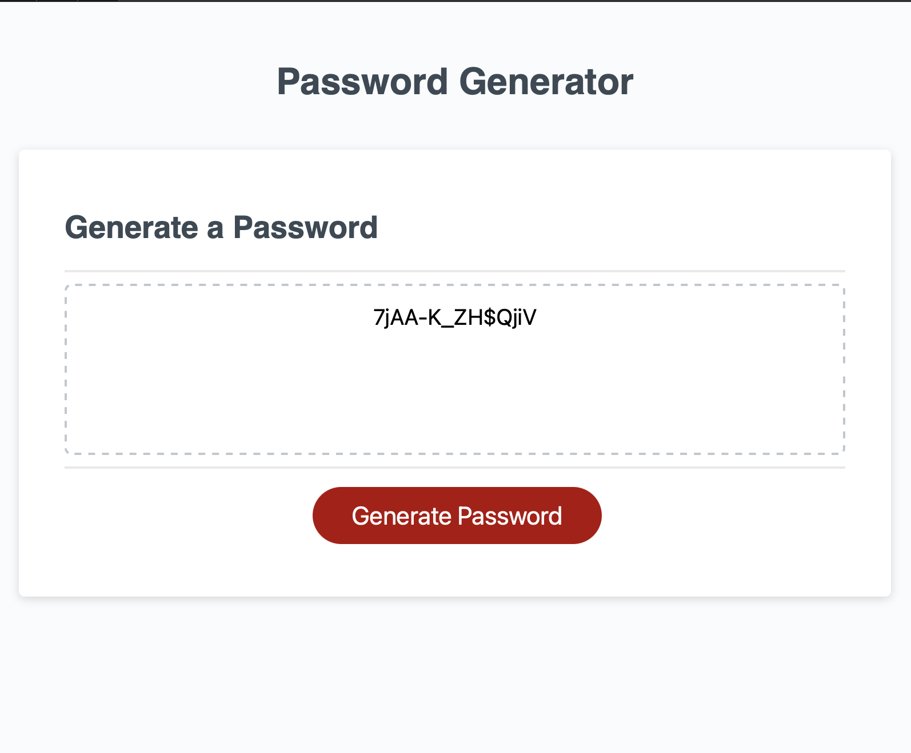

## Description

Editing a javascript file and finish building a password generator. The password generator prompts the user with a series of criteria that can be selected. After entering a desired password length, the generator will create a password meeting the selected criteria.

Note: I did google additional help with for loops (Math Random specifically).

## Screenshot

## Deployed Application

Link: 
